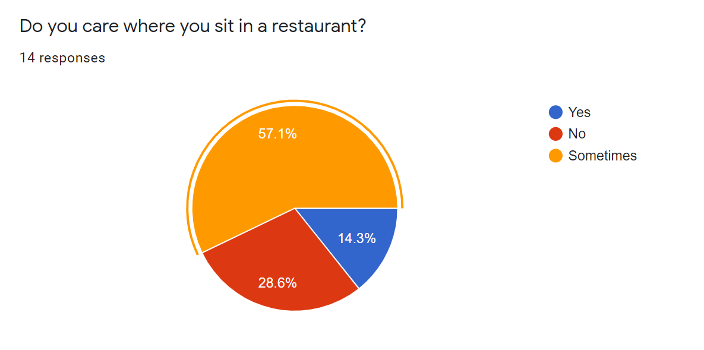
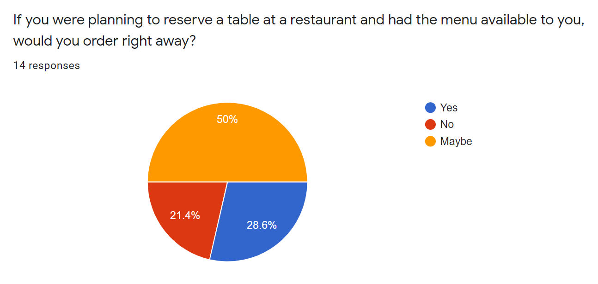
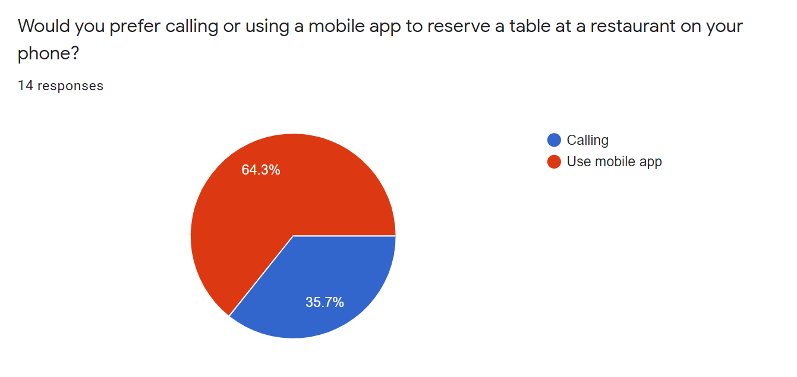
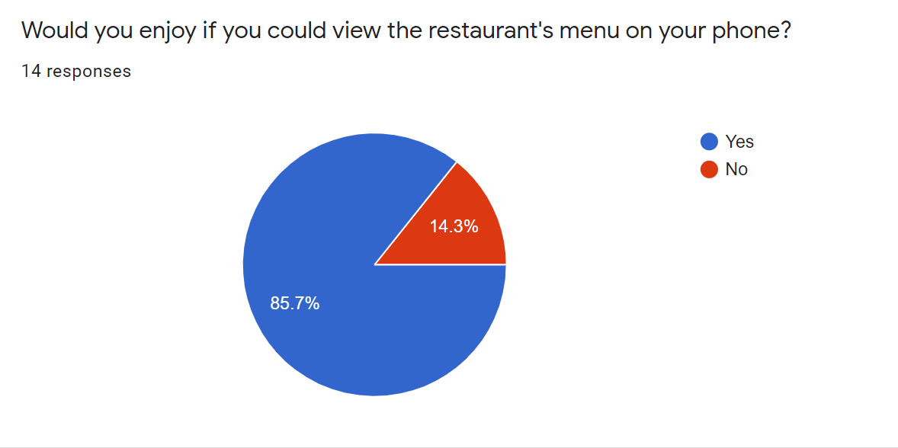

# Stage 2
Date: Oct 19th, 2020  
Title: Food Ordering & Reservation App  
PDF: [stage-two.pdf](stage-two.pdf)

## Description

The system we are designing will be a mobile application that allows customers to reserve their seats
at a restaurant, view menus, order food/drinks, pay for their orders in advance, while helping
restaurants to predict capacity, manage their operations and provide better services.

## System Tasks

### Must-be-included tasks

- Customer can book reservations for restaurants. They can choose the date and time from the
    calendar, enter number of people, preferred tables and customers’ details. Able to edit after
    words as well.
- After booking, customers will be able to see menus of the restaurants.
- Customers also have the option to order and pay beforehand or order when they arrive the
    restaurants.
- The host will be able to receive the booking information and manage orders. The host need
    to check customers in when they arrive.

### Important tasks

- Customers also get the shareable link to share with their friends and family who are going to
    the restaurants. They can click on the link and order in advance, or when they arrive.
- Customers can browse the restaurants close to them by allowing the app accessing their
    locations or enter city name.

### Could-be-included tasks

- After the bookings, customers will be asked for feedback on the app and reviews for the
    restaurants.
- If the clients do not show up to check in in the booked timeslots, the restaurant can mark the
    slot is available for other customers.
- The app can provide estimated wait time until the food is served.
- Restaurant owners can customize their restaurants profiles, edit menus, add promotions, add
    special hours, including tips recommendations and restrictions if they want.
- Allow users to pay in the counter in case their cards have issues.
- Allow users sign in, create a profile, add their favourite restaurants.

### Whom will the system be used by?

- Customers: who want to book reservations seamlessly to dine in at a restaurant. They can
    also receive their food faster, reduce interactions.
- Restaurant staff: instead of receiving phone calls for reservations, manually check their
    system if there are available tables and times. They are also able to manage their capacity,
    wait time and provide better services for customers.

## Stakeholders

### Customers
- Use the app to book reservations, this will allow restaurants to have better preparation,
    customers do not need to wait in line for a long time to get a table.
- Use the app to view menus and order right away, does not need to wait for waiters to bring
    menus, take orders and reduce service waiting time.
- Order and pay on their own devices to avoid interaction with staff member and public
    devices (such as menus, credit/debit machine), especially during the pandemic.
- Able to leave reviews and suggestions for their friends.

### Restaurant Staff

- Able to receive reservations without manually taking calls, checking available tables and
    time, increase proficiency for business operations.
- Able to manage customers’ orders and payments easier, especially for bill-splitting and in a
    big group of customers. This also helps avoiding wrong orders and track process status.
- Able to manage customers’ reservations easier, be flexible with changes and to increase
    business proficiency, reduce prediction across all stages.
- List offerings and serve foods once on demand, flexibility to adapt to customers.

### Business owners

- The app will provide orders & customers’ data which help business owners perform
    analytics and develop marketing strategy and business plan.
- Manage restaurants’ profiles, register on the app, process payments and other
    administrative works.

## User Research Methods

### 1. Activity Analysis

We wanted to see how the app OpenTable work, which is a similar concept to our app. Activity
analysis allows us to know what users will focus and interact with in the app. We had some
family and friends download the app and we checked how they interact with it.  

We learned that there are certain aspects of the OpenTable that users spent more time on than
others. This method allows us to find pros and cons of OpenTable and what we could do to make
ours better.  

What went wrong with this method is that I had to sit next to the user and time how long they
were on certain sections of the app. This could have affected the results since the user is being
watched. Things that went well was this method was easy to use since almost everyone has a
phone and I could write notes about their activity on the app. Things, I could have done
differently is I would not have told users why they had to download the app and just let them
use it.

Summary of what we learned from this method:

Designs we could improve are or should have:
- Allow users to order food and prepay ahead of time
- Keyword search in the search function
- Allow for guest sign in
- For the seat selection we could have an overview of the restaurant and where the seat is
- Better integration of the menu
- Allow reviews to be written in the app
- Rating of the cost of the menu items at a restaurant
- Notifications

Designs we should ignore:
- Filter restaurant by date available/make it better
- Have dine by cuisine at the bottom
- Better search navigation
- Not allow for multiple reservation on the same day same time
- No pictures of menu items

### 2. Questionnaire & Survey

We chose to do the questionnaire method to understand people’s views and experiences when
going to a restaurant. These views and opinions can help us determine which features we should
focus more and must implement, and which features we could add if we have the time.  

What went well is that with the gathered data, we noticed that the things that this app is
planning to solve such as phone menu viewing and table reservation, most people want it. We
also noticed that people would enjoy the side features of this app if they existed such as
selecting where to sit in a restaurant and having the food instantly served.  

What went poorly is that due to the amount of time we had for this stage, we were only able to
gather data from 14 people. Furthermore, some questions kind of overlapped, so two questions
were practically asking the same thing.

What we learned:
- People want to view the restaurant menu on their phones
- People would rather use an app to reserve a table than to call
- Being able to order prior to attending the restaurant is a feature most people would enjoy
    having
- Being able to select which table to sit is a feature most people would enjoy having

### 3. Paper Prototyping

Thirdly, we decided to use Paper Prototyping to roughly sketch our basic user interfaces and
interactions (See Appendix for Sketches).

To start our quick sketch, we firstly discussed what functionality our system has and design each
page accordingly. Within each page, icons and representative texts are used to emphasize the
functionalities. Arrows are used to represent the sequential relationships between pages. What
went well for us is we were able to visualize our design and interaction process. What went
poorly is we had some difficulties to show relationship of screens and some screens are too
abstract. We could have improved this by drawing all screens on one side of separate papers so
that we can show relationship easier. Also, the sketches should contain more representative
elements to make it clearer for everyone.

Our finding is that the prototype provides us visual representations of UI and operation
sequence. We also discovered some issues: it was too complicated to have an actual seat map,
number of people, date and time selection, and seat selection can be fitted into one page
instead of three. Paper prototyping help us to find the impracticality of some functions and
redundant pages.

### Summary of User Research Method

We chose Activity Analysis (Learn) method because we want to find pros and cons of the existing
app and how we can improve ours. Then this leads us to form Questionnaire and Survey (Ask)
method to interview users, identify customers’ preferences and behaviours to have better
understandings of current users’ experiences. Finally, we decided to use Paper Prototyping (Try)
to sketch interactions chains and evaluate our UI. Through these three methods, I have better
understanding of our customer segment, their behaviours, product’s functionalities. These
methods complement each other because they formed a sequential research process: about
current experiences, identify users’ perspective and create prototype that meets their needs. All
three cards help us understand customers and interaction process, which contribute towards
designing a complete solution.

## References

App: [https://www.opentable.ca/](https://www.opentable.ca/) used the mobile app  
Survey: [Food Ordering & Reservation Survey](https://forms.gle/yCHfxZ3k8jferAxn7)

## Repository and Portfolio

Repository: [https://github.com/CloudyYoung/cpsc-481-team-j](https://github.com/CloudyYoung/cpsc-481-team-j)  
Portfolio: [https://cloudyyoung.github.io/cpsc-481-team-j/](https://cloudyyoung.github.io/cpsc-481-team-j/)

## Appendix

### 1. Survey questions and some sample answers:
- How often do you
- Do you care where you sit in a restaurant?
- Do you know what you’re going to order when you dine-in at a restaurant?
- Would you enjoy if you could view the restaurant’s menu on your phone?
- Would you prefer calling or using a mobile app to reserve a table at a restaurant on your phone?
- Do you mind waiting for your food at a restaurant?
- Would you enjoy if the food was instantly served as soon as you sat down in a restaurant?
- If you were planning to reserve a table at a restaurant and had the menu available to you, would you order right away?

### 2. Activity Analysis

User can select reservation or takeout/delivery.

A few just scrolled through the lists others filtered by cuisine. The cost symbol on the side of
each restaurant was also a deciding factor. This means that this portion of the UI and UX needs
to be accessible and understandable. Some users already knew what restaurant to pick and used
to search section to find it. However, there was no list of search options when they type a few
words so that had to manually type the whole name to see if it is on the app.

If it is a restaurant the users did not know they would look at the review section of the
restaurant if it had bad reviews they would go back to searching. Users could not write reviews
on the app since. Otherwise they would continue to the menu section.

Users would look at the menu options. Some restaurants would require you to go to their
website to find the menu others had the menu in the app. The users tried to press on the menu
item they like but this app does not allow for ordering, so they were disappointed in that. This
occurred in the reservation section but not the order section.

Users also realized that there was a reserve section on the app. They were able to scroll though
the times available that day for the restaurant and select the number of people, however if it
was a reservation for 2 weeks ahead of time, they would have a calendar view to look at.
When they wanted to make the reservation, they had to go to a sign-up section. Users were
confused when they selected the date and number of seats using the small tab of the top left.
However, that was for filtering what restaurants could do that time. Users had to go to the
restaurant section and select the time on the date. Some restaurants gave seating options to the
user.

Users can edit the reservation easily. They go to the history section and can select the
reservation, giving options to cancel or accept. Also, notifications are given when the time of the
reservation is coming close.
Here is a graph of the major usages of the app:

This graph shows the percentage of a user's time on the different sections of the app. With this
we can see what needs to have a well-designed UI and UX experience.

### 3. Paper Prototyping Sketches:

