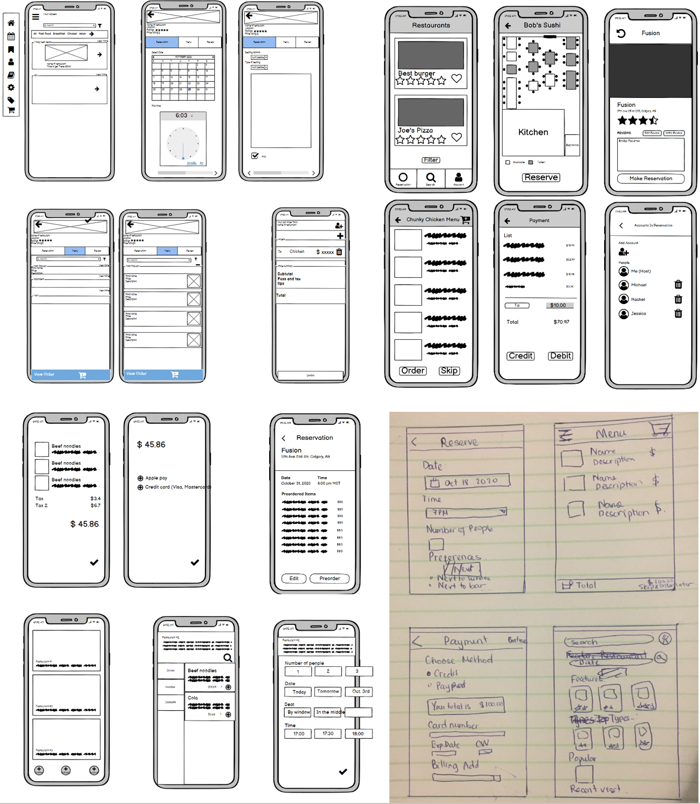
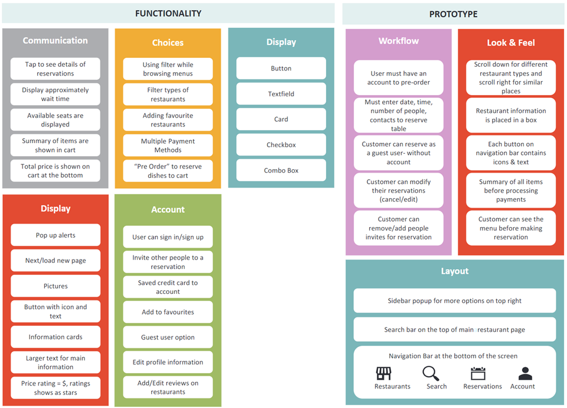

# Stage 3
{: .no_toc }

Date: Nov 09th, 2020  
Title: Reserving and Ordering Application  
PDF: [stage-three.pdf](stage-three.pdf)

## Table of contents
{: .no_toc .text-delta }

1. TOC
{:toc}

## Updated Project Idea

System we are designing is still a mobile application that allows customers to make restaurant reservations by
selecting date, time, number of people, and seat preference. Customers can sign in as a guest or log in to their
accounts. Customers can view a list of restaurants that are grouped by categories. A restaurants information
such as address, distance away, rating, review, images, etc. is displayed when clicked upon. Customers can
preview restaurants menus to decide if they want to make a reservation. After making a reservation customer
can preorder food items and add other accounts/people to a reservation. Customers are also able to write
reviews for a restaurant.

## Three Ideas

### I. Customer is able to click the preorder button and is able to add things to the food cart of that reservation
{: .no_toc }

- The user is able to click on a confirmed reservation and preorder
- The user is able to add and remove items from the food cart
- When the user checks-out, they are taken to the payment page

### II. Customer is able to modify reservation
{: .no_toc }

- The user is able to change the date and time of a confirmed reservation
- The user host is able to add and remove other users from this reservation
- The invited user is able to remove themselves from the reservation

### III. Navigation bar with buttons at the bottom
{: .no_toc }

- The four most important buttons are displayed at the bottom. (Restaurants, Search, Reservation, Account)
- The navigation bar is not always displayed in every screen of the app
- The buttons have both an icon and text to display what button it is

## List of updated user tasks

### Horizontal

- User can browse, search, and filter restaurants
- User can add restaurant to favourites
- User can remove a restaurant from favorites
- User can edit a reservation (reselect the date, time, number of people, and seating preference)
- User host can cancel a reservation
- User host can add other accounts to the reservation via email
- User host can remove accounts from the reservation
- User can view list of reservations
- User can view restaurant information by clicking on it
- User can browse restaurant dishes by category
- User can add a review to a restaurant
- User can edit the review they wrote of a restaurant

- User can give a restaurant rating out of 5
- User can view menu prior to making a reservation
- User can view menu when preordering
- User can view dish ingredients

### Vertical

- User making reservation
    o User can click on the date input to have a calendar view
    o User can select the time for the reservation
    o User can select the number of people for the reservation
    o User can select seat preference in the restaurant
- User paying for food
    o User can add a dish to the food cart
    o User can modify dish before adding it to the food cart
    o User can remove a dish from the food cart
    o User can choose method of payment and insert credit card details
- User can sign in
    o User can sign in as a guest or sign in account
    o User can create an account
    o User can log-out from account
    o User can view information about account

## Storyboard
A group of students have a reservation on Halloween at 6pm for 4 people. Since it happened to snow recently, some roads are closed so the students decide to change the reservation for next Friday at the same time. Unfortunately, one of the students got sick the day before Friday and won’t be able to come, so the students change the reservation from 4 to 3 people that will attend.

## Cognitive Evaluation
During our prototyping and task-centered system cognitive walkthrough we found some of our
tasks were not needed for our app and some we needed to add. We decided to break the tasks
into 5 major tasks and made the steps what we could do with that task.  
The restaurant tasks, where the restaurant could confirm that the group for the reservation has
arrived and allowing them to customize their own page. We decided that implementing this during
our prototype stage was going to be too much, we would have to create a separate UI for the
restaurant.  
The task where we have that users can see the menu after booking was limiting the user. We
changed the task so the viewer can just view the menu when they view the restaurant instead of
having to book first.  
We also decided to change how the sharable link task works. Instead, people would have to have
an account, the host would be able to add users by their email linked with their account. We
included some of our could be included tasks and removed others that felt extra.  
We also realized that a sign in/sign up option would be crucial for our app for some of our functions
such as favorites. We could allow the user to sign in as a guess as well. So, we moved it up to must
be included tasks. Added in our walkthrough many of the things they can do with account
Some important tasks we added are many more horizontal tasks. We made many tasks that allow
users to edit their choices such as reservations and menu.  
We changed the task: Allow users to pay in the counter in case their cards have issues. Users that
want to pre-order must pay beforehand.  

## Reflection
What we learned from this stage is the process of building up a project. The brainstorm part we
learned how to collect our ideas and group them up in an affinity diagram. The affinity diagram
allowed us to narrow down certain ideas. After choosing our most promising ideas the storyboard
helped us ask questions about what the UI may look like and how it can be used. Creating the low
fidelity prototype helped us look at our user tasks from a different perspective.  
We added and removed some user tasks from stage two from ideas we thought of during the
prototype. This stage helped us learn the process behind building a project.  
What went wrong is that we did not know that Balsamiq had a cloud share option. We would share
a person's screen who would make the prototype while others gave ideas and helped. We found
out halfway, if we could do this again, we would know to use the cloud immediately. Another
problem we had was understanding affinity diagrams. We extracted ideas from our sketches but had
no idea on how we would group them. We asked the TA multiple times to explain the affinity
diagram to us and eventually we were able to group them.  

## Appendix

### 1. Sketches

### 2. Affinity Diagram

### 3. User-centered Task Table

<table>
    <tr>
        <td>Main Task</td>
        <td>Description of task step</td>
        <td>Does user have training or knowledge to do this step? </td>
        <td>Is it believable that they would do it?</td>
        <td>Are they motivated?</td>
        <td>Comments (including possible solutions)</td>
    </tr>
    <tr>
        <td rowspan="11">Reserving</td>
        <td>Browse, search, and filter restaurants</td>
        <td>Yes</td>
        <td>Yes</td>
        <td>Yes</td>
        <td>Scroll through restaurants, search and filter</td>
    </tr>
    <tr>
        <td>View the restaurant information</td>
        <td>Yes</td>
        <td>Yes</td>
        <td>Yes</td>
        <td>Customers can view the detailed information of a restaurant, including the name, address, rates and reviews, and categories</td>
    </tr>
    <tr>
        <td>Add a restaurant to favorite</td>
        <td>Yes</td>
        <td>Yes</td>
        <td>Yes</td>
        <td>On the restaurant information page, they would tap the heart icon to add the restaurant as favorite</td>
    </tr>
    <tr>
        <td>Remove a restaurant from favorite</td>
        <td>Yes</td>
        <td>Yes</td>
        <td>Yes</td>
        <td>On the restaurant information page, tap the heart icon again to remove</td>
    </tr>
    <tr>
        <td>Reserve a table at a restaurant (select the date, time, number of people, seating preferences and customers’ details) MUST</td>
        <td>Yes</td>
        <td>Yes</td>
        <td>Yes</td>
        <td>Reservation page for users to select options for date, time, number of people and seat preference</td>
    </tr>
    <tr>
        <td>Edit a reservation (reselect the date, time, number of people, seating preferences and customers’ details)</td>
        <td>Yes</td>
        <td></td>
        <td>Yes</td>
        <td>Customers can click on the reservation card to edit information about the reservation</td>
    </tr>
    <tr>
        <td>Delete a reservation</td>
        <td>Yes</td>
        <td>Yes</td>
        <td>Yes</td>
        <td>Customers will see the delete button on the reservation card to cancel a reservation. A pop up will appear to confirm it</td>
    </tr>
    <tr>
        <td>View restaurant menu MUST</td>
        <td>Yes</td>
        <td>Yes</td>
        <td>Yes</td>
        <td>Have a menu button when they select a restaurant</td>
    </tr>
    <tr>
        <td>Invite other customers to a reservation by their accounts, to make the reservation into a group reservation and order together</td>
        <td>Yes</td>
        <td>Yes</td>
        <td>Yes</td>
        <td>A customer can make a reservation as the reservation owner. After the reservation is official and confirmed by the hostess. The customers can invite other accounts to the reservation. All the customers in the group can all order their food for their own.</td>
    </tr>
    <tr>
        <td>View other customers in a group reservation</td>
        <td>Yes</td>
        <td>Yes</td>
        <td>Yes</td>
        <td>For all customers in a group reservation, they can view other customers in the group</td>
    </tr>
    <tr>
        <td>Remove other customers from a group reservation</td>
        <td>Yes</td>
        <td>Yes</td>
        <td>Yes</td>
        <td>For a group reservation owner, they can remove any other customers in the group if necessary</td>
    </tr>
    <tr>
        <td rowspan="7">Account</td>
        <td>Sign in as a guest or a user MUST</td>
        <td>Yes</td>
        <td>Yes</td>
        <td>Yes</td>
        <td>Have a main screen to determine if the user wants to sign in or be a guest</td>
    </tr>
    <tr>
        <td>Create an account </td>
        <td>Yes</td>
        <td>Yes</td>
        <td>No</td>
        <td>Give an option to create an account. Give quick sign in options by third parties, like Google / Facebook</td>
    </tr>
    <tr>
        <td>View account information</td>
        <td>Yes</td>
        <td>Yes</td>
        <td>Yes</td>
        <td></td>
    </tr>
    <tr>
        <td>Modify account preference setting</td>
        <td>Yes</td>
        <td>Yes</td>
        <td>Yes</td>
        <td></td>
    </tr>
    <tr>
        <td>Modify account privacy setting</td>
        <td>Yes</td>
        <td>Yes</td>
        <td>Yes</td>
        <td></td>
    </tr>
    <tr>
        <td>Visit help center</td>
        <td>Yes</td>
        <td>Yes</td>
        <td>Yes</td>
        <td></td>
    </tr>
    <tr>
        <td>Sign out from account</td>
        <td>Yes</td>
        <td>Yes</td>
        <td>Yes</td>
        <td></td>
    </tr>
    <tr>
        <td rowspan="5">Ordering</td>
        <td>Browse dishes by categories</td>
        <td>Yes</td>
        <td>Yes</td>
        <td>Yes</td>
        <td>Customers can browse dishes by categories by clicking the name of categories</td>
    </tr>
    <tr>
        <td>Add dishes to food cart</td>
        <td>Yes</td>
        <td>Yes</td>
        <td>Yes</td>
        <td>Customers can choose to order when they arrive the restaurant</td>
    </tr>
    <tr>
        <td>Remove dishes from food cart</td>
        <td>Yes</td>
        <td>Yes</td>
        <td>Yes</td>
        <td>Customers can remove dishes by certain amount too</td>
    </tr>
    <tr>
        <td>Pay for food cart MUST</td>
        <td>Yes</td>
        <td>Yes</td>
        <td>Yes</td>
        <td>Customers presses checkout on the food cart and is taken to the bill screen</td>
    </tr>
    <tr>
        <td>Review the order to confirm and see the total price</td>
        <td>Yes</td>
        <td>Yes</td>
        <td>Yes</td>
        <td>After adding all the dishes, users will have to review the order to confirm on order page</td>
    </tr>
    <tr>
        <td rowspan="3">Payment</td>
        <td>Review summary of the order</td>
        <td>Yes</td>
        <td>Yes</td>
        <td>Yes</td>
        <td></td>
    </tr>
    <tr>
        <td>Choose payment method</td>
        <td>Yes</td>
        <td>Yes </td>
        <td>Yes</td>
        <td>Customers can pay with PayPal, credit/debit cards</td>
    </tr>
    <tr>
        <td>Add tips</td>
        <td>Yes</td>
        <td>Yes</td>
        <td>No</td>
        <td>Customer can pay tip for a reservation after finishing meal through app</td>
    </tr>
    <tr>
        <td rowspan="3">Reviewing</td>
        <td>Rate restaurant comment</td>
        <td>Yes</td>
        <td>Yes</td>
        <td>No</td>
        <td>A “Rate this restaurant” button will be displayed when a reservation is ended, and they will be asked to rate the restaurant and write comments as review</td>
    </tr>
    <tr>
        <td>Edit or delete rating comment</td>
        <td>Yes</td>
        <td>Yes</td>
        <td>No</td>
        <td>On review section, customers can see their previous review and edit or delete them</td>
    </tr>
    <tr>
        <td>Add a rating out of 5 to the restaurant</td>
        <td>Yes</td>
        <td>Yes</td>
        <td>Yes</td>
        <td>User can click whichever star they think is best adequate for the restaurant</td>
    </tr>
</table>